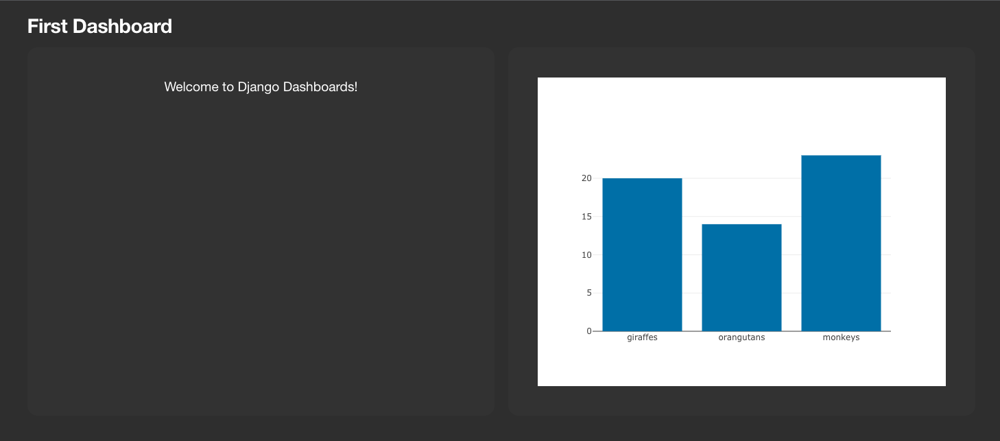
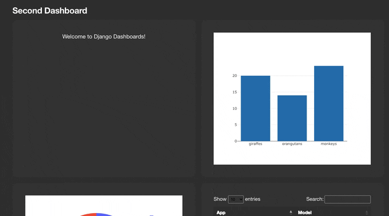

=================
Django Dashboards
=================

Tools to help you build data dashboards in Django.

https://github.com/wildfish/django-dashboards

.. image:: https://github.com/wildfish/django-dashboards/actions/workflows/build.yml/badge.svg
    :target: https://github.com/wildfish/django-dashboards

.. image:: https://codecov.io/gh/wildfish/django-dashboards/branch/main/graph/badge.svg
  :target: https://codecov.io/gh/wildfish/django-dashboards

.. image:: https://badge.fury.io/py/django-dashboards.svg
    :target: https://pypi.python.org/pypi/django-dashboards/

.. image:: https://img.shields.io/pypi/pyversions/django-dashboards.svg
    :target: https://pypi.python.org/pypi/django-dashboards/

Features
========

* Dashboard view generation with components including stats, tables, charts and more.
* HTMX driven dashboards and templates for a modern MPA interface.

Supports Django 3.2 to 4.1, on Python 3.9+.

See the `full documentation <https://wildfish-django-dashboards.readthedocs.io>`_ for details
of how django-dashboards works.

.. inclusion-quickstart-do-not-remove

Quickstart
==========

This is a quickstart guide for creating a simple dashboard.

Project Setup
-------------

We recommend using a virtual environment such as `pyenv <https://github.com/pyenv/pyenv>`_ to manage your
dependencies and Python versions. From this point we assume you have a environment setup, activated & pip installed.

Create a new Django project::

    # Create the project directory
    mkdir demo
    cd demo

    # Install
    pip install django-dashboards

    # Set up a new project
    django-admin startproject demo .
    cd demo
    django-admin startapp mydashboard
    cd ..

    # Sync the database
    python manage.py migrate

Dashboards
----------
First you need to setup a dashboard definition.  Create a new file :code:`demo/mydashboard/dashboards.py`::

    from dashboards.dashboard import Dashboard
    from dashboards.component import Text, Chart
    from dashboards.registry import registry

    from demo.mydashboard.data import DashboardData

    class FirstDashboard(Dashboard):
        welcome = Text(value="Welcome to Django Dashboards!")
        animals = Chart(defer=DashboardData.fetch_animals)

        class Meta:
            name = "First Dashboard"

    registry.register(FirstDashboard)

Remember to register your dashboard class in order for it to work with the auto urls.

Data
----
Data for the dashboard component can be inline (welcome) or come from a callable (animals).
In the example above the data for animals is returned from fetch_animals.  We set this up now.
Create a new file :code:`demo/mydashboard/data.py`::

    import json

    class DashboardData:
        @staticmethod
        def fetch_animals(**kwargs) -> str:
            data = {"giraffes": 20, "orangutans": 14, "monkeys": 23}

            return json.dumps(dict(
                data=[
                    dict(
                        x=list(data.keys()),
                        y=list(data.values()),
                        type="bar",
                    )
                ]
            ))

This returns a json object with values for x, y, and type.  This is interpreted by the component and rendered as a bar chart.

Config
------
In order to get the auto urls to register we need to update :code:`demo/mydashboard/apps.py`::

    from django.apps import AppConfig

    class MydashboardConfig(AppConfig):
        default_auto_field = 'django.db.models.BigAutoField'
        name = 'demo.mydashboard'

        def ready(self):
            # for registry
            import demo.mydashboard.dashboards  # type: ignore # noqa

URLs
----
Next we need to wire up the dashboard urls.  In :code:`demo/urls.py`::

    from django.contrib import admin
    from django.urls import include, path

    urlpatterns = [
        path('admin/', admin.site.urls),
        path('dashboards/', include('dashboards.urls')),
    ]

Settings
--------
Finally add :code:`dashboards` and your new app :code:`demo.mydashboard` to INSTALLED_APPS in :code:`demo/settings.py`::

    INSTALLED_APPS = [
        ...
        "dashboards",
        "demo.mydashboard",
    ]

And we're done.

Viewing the Dashboard
---------------------
Start the Django server from the command line.::

    python manage.py runserver

The dashboard urls are automatically generated based on the app name and dashboard meta name.
For this demo the url will be :code:`http://127.0.0.1:8000/dashboards/mydashboard/firstdashboard/`

Expanding your dashboard
------------------------

`FirstDashboard was very simplistic, so lets expand on that and use some more components`. We'll inherit
from `FirstDashboard` to create::

    from dashboards.dashboard import Dashboard
    from dashboards.component import Text, Chart, Table
    from dashboards.registry import registry

    from demo.mydashboard.data import DashboardData, ContentTypeTableSerializer, ContentTypeChartSerializer

    class FirstDashboard(Dashboard):
        welcome = Text(value="Welcome to Django Dashboards!")
        animals = Chart(defer=DashboardData.fetch_animals)

        class Meta:
            name = "First Dashboard"

    class SecondDashboard(FirstDashboard):
        express_animals = Chart(defer=DashboardData.express_animals)
        content_types = Table(value=ContentTypeTableSerializer)
        content_types_chart = Chart(defer=ContentTypeChartSerializer, grid_css_classes="span-12")

        class Meta:
            name = "Second Dashboard"

    registry.register(FirstDashboard)
    registry.register(SecondDashboard)

and::

    import json

    import plotly.express as px
    from django.contrib.contenttypes.models import ContentType

    from dashboards.component.chart import ChartSerializer
    from dashboards.component.table import TableSerializer

    class DashboardData:
        @staticmethod
        def fetch_animals(**kwargs) -> str:
            data = {"giraffes": 20, "orangutans": 14, "monkeys": 23}

            return json.dumps(dict(
                data=[
                    dict(
                        x=list(data.keys()),
                        y=list(data.values()),
                        type="bar",
                    )
                ]
            ))

        @staticmethod
        def express_animals(**kwargs):
            data = dict(
                animal=["giraffes", "orangutans", "monkeys"],
                value=[20, 14, 23]
            )

            fig = px.pie(
                data,
                names='animal',
                values='value',
            )

            return fig.to_json()

    class ContentTypeTableSerializer(TableSerializer):
        class Meta:
            columns = {
                "app_label": "App",
                "model": "Model"
            }
            model = ContentType

    class ContentTypeChartSerializer(ChartSerializer):
        class Meta:
            fields = ["app_label", "model"]
            model = ContentType

        def to_fig(self, df):
            fig = px.scatter(
                df,
                x="app_label",
                y="model",
            )

            return fig

Here we've added a few more components:

* ``express_animals`` - A deferred pie chart, that instead of direct json renders via `plotly express <https://plotly.com/python/plotly-express/>`_ to_json(), which allows us to quick;y convert dicts and Pandas DataFrames into charts.
* ``content_types`` - A table (which could also be deferred) via our ``TableSerializer``, which outputs data direct from a django model.
* ``content_types_chart`` - A chart which is an example of a ``ChartSerializer``, again outputting data direct from a django model.

Which looks like:

.. inclusion-quickstart-end-do-not-remove
