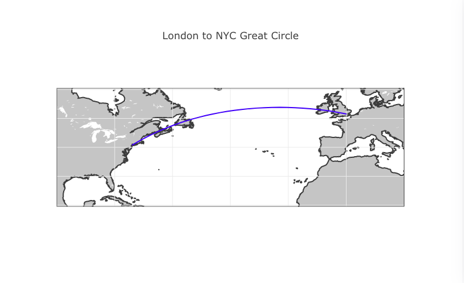
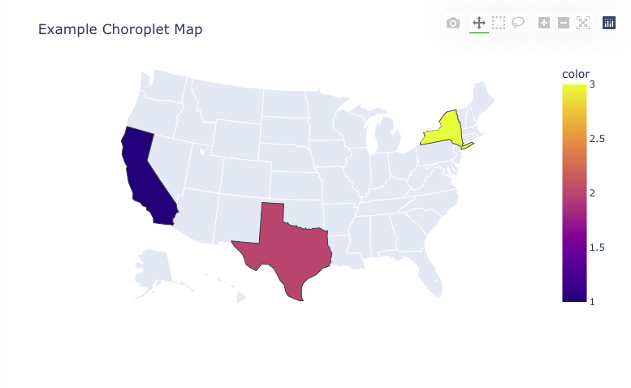
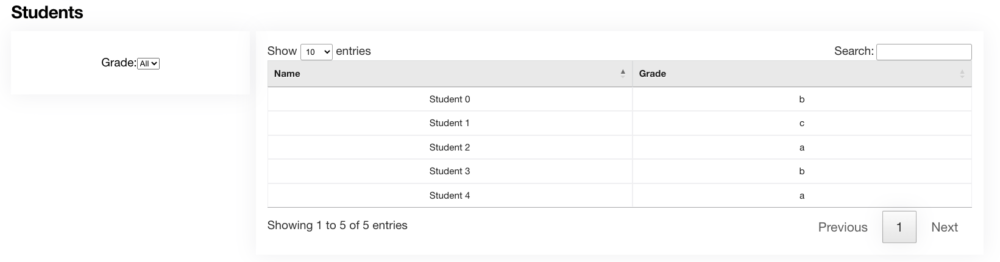

Included components
===================

Text
++++

Text component is the simplest component. It can be used to display a message:

::

    from dashboards.component import Text
    from dashboards.dashboard import Dashboard

    class ExampleDashboard(Dashboard):
        text_example = Text(value="Rendered on load")
        html_example = Text(
            value="<strong>HTML also rendered on load</strong>",
            mark_safe=True,
        )

The `Text` component can render either plain text or HTML with the addition of the `mark_safe=True` attribute.

Stat
++++

Stat is simply a more controller version of Text, with a little more styling/layout applied to the template:

::

    from dashboards.component import Text
    from dashboards.component.text import StatData
    from dashboards.dashboard import Dashboard

    class ExampleDashboard(Dashboard):
        stat_one = Stat(
            value=StatData(text="100%", sub_text="increase")
        )
        stat_two = Stat(
            value=StatData(text="88%", sub_text="decrease", change_by="12%"),
        )

``Text`` will be the main value and ``sub_text`` appearing below, ``change_by`` and ``change_by_text`` can
also be used to display additional information.

Note that StatData is a convenience class, a dict would also work.

Chart
+++++

Charts are displayed front end with plotly.js - a component simply needs to return valid json representation
of a plotly chart to the component.

The simplest way to do this is with `Plotly Express <https://plotly.com/python/plotly-express/>`_.

::

    from dashboards.component import Chart
    from dashboards.dashboard import Dashboard

    import plotly.express as px

    def get_bubble_chart(*args, **kwargs):
        df = px.data.iris()
        fig = px.scatter(
            df,
            x="sepal_width",
            y="sepal_length",
            size="petal_length",
            color="species",
        )
        fig = fig.update_traces(mode="markers")
        return fig.to_json()

    class ExampleDashboard(Dashboard):
        bubble_chart_example = Chart(defer=get_bubble_chart)

.. image:: ../_images/components_chart_example.png
   :alt: Chart Example

However, you can also leverage our ``ChartSerializer`` to make this more concise and reusable. For example if we had

::

    from typing import Optional

    import plotly.express as px

    from dashboards.component.chart import ChartSerializer

    class ScatterChartSerializer(ChartSerializer):
        x: Optional[str] = None
        y: Optional[str] = None
        size: Optional[str] = None
        color: Optional[str] = None
        mode: Optional[str] = "markers"

        def get_x(self, df) -> str:
            return self.x

        def get_y(self, df) -> str:
            return self.y

        def get_size(self, df) -> str:
            return self.size

        def to_fig(self, df) -> go.Figure:
            fig = px.scatter(
                df,
                x=self.get_x(df),
                y=self.get_y(df),
                size=self.get_size(df),
                color=self.color,
            )
            fig = fig.update_traces(mode=self.mode)

            return fig

    class ExampleBubbleChartSerializer(ScatterChartSerializer):
        x = "sepal_width"
        y = "sepal_length"
        color = "species"
        size = "petal_length"

        class Meta:
            title = "Bubble Chart Example"

        def get_data(self, *args, **kwargs):
            return px.data.iris()

We can then call the serializer with:

::

    from dashboards.component import Chart
    from dashboards.dashboard import Dashboard

    class ExampleDashboard(Dashboard):
        bubble_chart_example = Chart(
            defer=ExampleBubbleChartSerializer
        )

This produces the same chart as in the first example.

Chart serializers also come with other benefits like ORM integration, empty chart generation, the ability to apply
common layouts etc. For more examples please see the :doc:`Chart Serializers <../serializers/chart>` docs.

Map
+++

Maps are also displayed front end with plotly.js - a component simply needs to return valid json representation
of a plotly map or mapbox map to the component.

::

    import json
    from dashboards.component import Map
    from dashboards.dashboard import Dashboard

    def fetch_scatter_map_data(*args, **kwargs):
        return json.dumps(
            dict(
                data=[
                    dict(
                        lat=[40.7127, 51.5072],
                        lon=[-74.0059, 0.1275],
                        mode="lines",
                        type="scattergeo",
                        line={"width": 2, "color": "blue"},
                    )
                ],
                layout=dict(
                    title="London to NYC Great Circle",
                    showlegend=False,
                    geo={
                        "resolution": 50,
                        "showland": True,
                        "showlakes": True,
                        "landcolor": "rgb(204, 204, 204)",
                        "countrycolor": "rgb(204, 204, 204)",
                        "lakecolor": "rgb(255, 255, 255)",
                        "projection": {"type": "equirectangular"},
                        "coastlinewidth": 2,
                        "lataxis": {
                            "range": [20, 60],
                            "showgrid": True,
                            "tickmode": "linear",
                            "dtick": 10,
                        },
                        "lonaxis": {
                            "range": [-100, 20],
                            "showgrid": True,
                            "tickmode": "linear",
                            "dtick": 20,
                        },
                    },
                ),
            )
        )

    class ExampleDashboard(Dashboard):
        scatter_map_example = Map(defer=fetch_scatter_map_data)

Because `Map` is just an extension of `Chart` you can also leverage plotly express and `ChartSerializer`
to render maps.

::

    # dashboards.py
    from typing import Optional, List
    import plotly.express as px

    from dashboards.component.chart import ChartSerializer
    from dashboards.component import Map
    from dashboards.dashboard import Dashboard

    class ChoroplethMapSerializer(ChartSerializer):
        locations: List[str]
        locationmode: Optional[str] = "USA-states"
        color: Optional[List[int]] = None
        scope: Optional[str] = "usa"

        def get_data(self, *args, **kwargs):
            return dict(
                locations=self.locations,
                locationmode=self.locationmode,
                color=self.color,
                scope=self.scope,
            )

        def to_fig(self, data) -> go.Figure:
            fig = px.choropleth(
                **data
            )

            return fig

    class ExampleMapSerializer(ChoroplethMapSerializer):
        locations = ["CA", "TX", "NY"]
        color = [1, 2, 3]

        class Meta:
            title = "Example Choroplet Map"

    class ExampleDashboard(Dashboard):
        map_example = Map(defer=ExampleMapSerializer)

Using Chart serializers comes with other benefits such as ORM integration, empty chart generation, the ability to apply
common layouts etc. For more examples please see the :doc:`Chart Serializers <../serializers/chart>` docs.

Table
+++++

When rendered with as a Django view without the built-in templates, datatables.js will be applied to the table component.

To make tables easier to add to a component, you can subclass `TableSerializer` and pass
it's `serialize` function directly to defer or value. This will give you a searchable and sortable
table component:

::

    # dashboards.py
    ...
    table_example = Table(
        defer=ExampleTableSerializer,
    )

::

    # tables.py
    from dashboards.component.table import TableSerializer

    class ExampleTableSerializer(TableSerializer):
        class Meta:
            title = "Example table"
            columns = {
                "id": "Title",
                "name": "Name",
                "progress": "Progress",
                "gender": "Gender",
                "dob": "DOB",
            }

        @staticmethod
        def get_data(**kwargs):
            return [
                {
                    "id": 1,
                    "name": f"Name",
                    "progress": 1,
                    "gender": "male",
                    "rating": 1,
                    "col": 1,
                    "dob": "19/02/1984",
                }
            ]

Serializer can also be driven directly from Meta.model or defining a get_queryset(obj) method:

::

    class ExampleTableSerializer(TableSerializer):
        class Meta:
            title = "Staff table"
            columns = {
                "id": "ID",
                "first_name": "First Name",
            }
            # model = User

        @classmethod
        def get_queryset(cls, **kwargs):
            """
            kwargs are passed through from value/defer as above
            """
            return User.objects.filter(is_staff=True)

You can also customise any of the columns in the serializer via `get_FOO_value`:

::

    class ExampleTableSerializer(TableSerializer):
        ...

        @staticmethod
        def get_first_name_value(obj):
            return obj.first_name.upper()

Additional `Table` attributes:

* ``page_size`` (``int`` - ``default=10``): set the paging size
* ``searching/paging/ordering`` (``bool`` - ``default=True``): enable/disable relevant datatables features.

Additional `TableSerializer` Meta attributes

* ``first_as_absolute_url`` (``bool`` - ``default=False``): if the model or object has a get_absolute_url use it in the first column.
* ``force_lower`` - (``bool`` - ``default=True``): forces searching and sorting of data to use lower values.

BasicTable
++++++++++

Basic tables work the same as table, with the js, search & sort disabled.

::

    table_example_not_deferred = BasicTable(
        value=ExampleTableSerializer,
    )

Form
++++

The ``Form`` component allows you to add forms to your dashboard.
There are a number of reasons why you may want to do this, such as: adding filtering
or including a form to create an object.

To include a form in your Dashboard simple add a ``Form`` component and pass
a ``DashboardForm`` instance as the ``form`` attribute.  A ``DashboardForm`` is
a normal Django ``Form`` with some additional helper methods.

As well as the form you can pass some optional attributes to control how it functions:

* ``css_classes`` (``dict``): Allows you to change the default css class for ``form``, ``table`` and ``button``
* ``form`` (``DashboardForm``): The Form to render
* ``method`` (``str``): whether to submit the form as a GET or a POST
* ``trigger`` (``str``): what triggers a change.  Can be ``change`` or ``submit``
* ``submit_url`` (``str``): url the form submits to.

::

    from django import forms

    from dashboards.dashboard import Dashboard
    from dashboards.component import Form
    from dashboards.forms import DashboardForm

    class GradeForm(DashboardForm):
        grade = forms.ChoiceField(
            choices=(
                ("all", "All"),
                ("a", "A"),
                ("b", "B"),
                ("c", "C"),
            )
        )

    class DemoDashboard(Dashboard):
        grade_form = Form(
            form=GradeForm,
        )
        ...

This creates a form with a single dropdown with grades form A-C shown.  You can imagine
this being useful as a filter on a table, where students can be filtered based on
their grade.

::

    # dashboards.py
    import random
    from django import forms

    from dashboards.dashboard import Dashboard
    from dashboards.component import Form
    from dashboards.forms import DashboardForm
    from dashboards.component.table import TableSerializer

    class StudentSerializer(TableSerializer):
        class Meta:
            title = "Students"
            columns = {
                "name": "Name",
                "grade": "Grade",
            }

        @staticmethod
        def get_data(filters, **kwargs):
            students = [
                {
                    "name": f"Student {r}",
                    "grade": random.choice(["a", "b", "c"]),
                }
                for r in range(10)
            ]
            # apply grade filter if available
            if filters and "grade" in filters and filters["grade"] != "all":
                students = list(filter(lambda x: x["grade"] == filters["grade"], students))

            return students

    class GradeForm(DashboardForm):
        grade = forms.ChoiceField(
            choices=(
                ("all", "All"),
                ("a", "A"),
                ("b", "B"),
                ("c", "C"),
            )
        )

    class StudentDashboard(Dashboard):
        grade_form = Form(
            form=GradeForm,
            method="get",
            dependents=["student_table"],
        )
        student_table = Table(value=StudentSerializer)

        class Meta:
            name = "Students"

    registry.register(StudentDashboard)

.. image:: ../_images/components_form_filter_applied.png
   :alt: Form Filter Applied

This example includes everything in the one file but in reality you may want to
split these up into different files to keep your code clean.

You will notice ``dependents`` has been set as an attribute on the ``Form`` component.
If populated, this refreshes all components listed when the form is changed.
In the example above, ``student_table`` will be refreshed when the ``grade_form``
changes.

As well as reloading the component, all form data is automatically passed into
the ``get_data()`` method of the ``TableSerializer`` when the form is changed.
In the example we use this to filter down the students based on the grade selected.

As mentioned you may also want to add a form which creates data.  This can also
be achieved following the same process but with an additional ``save()`` method
on the ``DashboardForm`` to define how to create the data.  When doing this type
of form you will also want to pass ``method="post"`` and ``trigger="submit"`` into
the ``Form`` component

::

    # dashboards.py
    import random
    import copy
    from django import forms

    from dashboards.dashboard import Dashboard
    from dashboards.component import Form
    from dashboards.forms import DashboardForm
    from dashboards.component.table import TableSerializer

    student_list = [
        {
            "name": f"Student {r}",
            "grade": random.choice(["a", "b", "c"]),
        }
        for r in range(5)
    ]

    class StudentSerializer(TableSerializer):
        class Meta:
            title = "Students"
            columns = {
                "name": "Name",
                "grade": "Grade",
            }

        @staticmethod
        def get_data(filters, **kwargs):
            global student_list

            students = copy.copy(student_list)

            # apply grade filter if available
            if filters and "grade" in filters and filters["grade"] != "all":
                students = list(filter(lambda x: x["grade"] == filters["grade"], students))

            return students

    class GradeForm(DashboardForm):
        grade = forms.ChoiceField(
            choices=(
                ("all", "All"),
                ("a", "A"),
                ("b", "B"),
                ("c", "C"),
            )
        )

    class AddStudentForm(DashboardForm):
        name = forms.CharField(required=True)
        final_grade = forms.ChoiceField(
            choices=(
                ("a", "A"),
                ("b", "B"),
                ("c", "C"),
            )
        )

        def save(self):
            global student_list

            student_list.append(
                {
                    "name": self.cleaned_data["name"],
                    "grade": self.cleaned_data["final_grade"],
                }
            )

    class StudentDashboard(Dashboard):
        grade_form = Form(
            form=GradeForm,
            method="get",
            dependents=["student_table"],
        )
        student_table = BasicTable(value=StudentSerializer)
        add_form = Form(
            form=AddStudentForm,
            method="post",
            trigger="submit",
            css_classes={"btn": "btn btn-primary"},
            dependents=["student_table"]
        )

        class Meta:
            name = "Students"

    registry.register(StudentDashboard)

.. image:: ../_images/components_add_form.png
   :alt: Form Filter Applied

Notice that we are updating a global variable for ``student_list`` in this example
but in real life you could do this with a django Model instead.