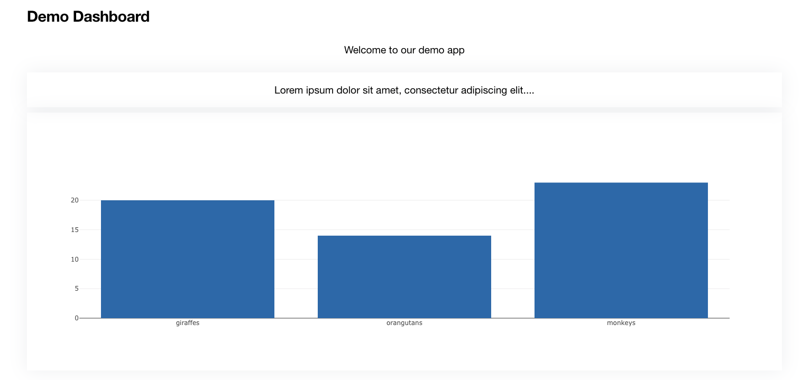
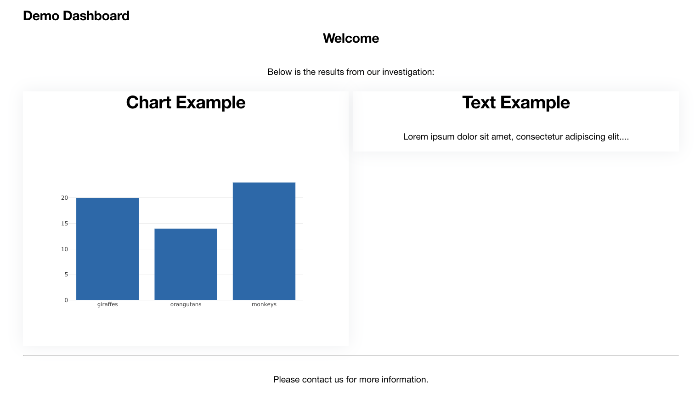

=======
Layouts
=======

Dashboards by with our default styles applied display components in a 2 column grid but this can be
changed to fit your needs.  This is done by adding a ``Layout``
class to your Dashboard and populating the ``components`` attribute with a
:code:`ComponentLayout` class.  In this you can order your components and position
them on screen using common HTML elements such Divs.

ComponentLayout Class
---------------------

:code:`ComponentLayout` is assigned to the :code:`components` element
of the :code:`Layout` class of a :code:`Dashboard` object.

They are initialized with a number of classes, which can be
of type :code:`Components`, :code:`HTMLComponentLayout` or :code:`HTML`.
:code:`Components` reference the component elements in the Dashboard,
:code:`HTMLComponentLayout` is a HTML element wrapper.  These can be nested
which is how complex layouts can be achieved.
:code:`HTML` allow you to add raw HTML within a dashboard.

We can add a custom layout to the example dashboard from the quickstart guide

:code:`demo/mydashboard/dashboards.py`::


    from dashboards.component.layout import ComponentLayout, HTML, Card, Header
    from dashboards.dashboard import Dashboard
    from dashboards.component import Text
    from dashboards.registry import registry


    class LayoutDashboard(Dashboard):
        welcome = Text(value="Welcome to Django Dashboards!")
        nested_one = Text(value="1")
        nested_two = Text(value="2")

        class Meta:
            name = "First Dashboard"

        class Layout(Dashboard.Layout):
            components = ComponentLayout(
                Header(heading="Hello", size=2),
                HTML("<small>123.00</small>"),
                Card("welcome", grid_css_classes="span-12"),
                Card("nested_one", "nested_two"),
            )


    registry.register(LayoutDashboard)


When referencing dashboard components you just need to add the component attribute in a string. Components and
Layout classes can also be nested as shown above, allowing you to add your own layout classes and add
further control.



This is a very basic example but you can do much more.  Lets now change the layout::


    from dashboards.component.layout import ComponentLayout, HTML, Card, Header, Div
    from dashboards.dashboard import Dashboard
    from dashboards.component import Text
    from dashboards.registry import registry


    class LayoutDashboard(Dashboard):
        welcome = Text(value="Welcome to Django Dashboards!")
        nested_one = Text(value="1")
        nested_two = Text(value="2")

        class Meta:
            name = "Layout Dashboard"

        class Layout(Dashboard.Layout):
            components = ComponentLayout(
                Header(heading="Welcome", size=2),
                HTML("<p>Below is the results from our investigation:</p>"),
                Card(
                    HTML("<h1>Welcome Example</h1>"),
                    Div("welcome", grid_css_classes="span-12"),
                    grid_css_classes="span-6"
                ),
                Card(
                    HTML("<h1>Nested Example</h1>"),
                    Div("nested_one", grid_css_classes="span-6"),
                    Div("nested_two", grid_css_classes="span-6"),
                    grid_css_classes="span-6"
                ),
                HTML("<p>Please contact us for more information.</p>")
            )


    registry.register(LayoutDashboard)


This creates



HTMLComponentLayout attributes
------------------------------

All :code:`HTMLComponentLayout` objects can accept a number of kwargs.
These vary depending on the element but common to all objects are
:code:`css_classes` and :code:`grid_css_classes`.

grid_css_classes
================

In the examples above we used ``grid_css_classes`` to change the width.

If we had 3 components we could add the extra card and change the grid_css_classes to "span-4".::

    Card(
        "component_name",
        grid_css_classes="span-4"
    ),

The started css provided has a grid layout is based on 12 columns i.e span-4, span-6 etc.

To save on typing and to make things easier to update we recommend creating a helper
class to define css classes.  e.g.::

    class Grid(Enum):
        DEFAULT = config.Config().DASHBOARDS_DEFAULT_GRID_CSS
        ONE = "span-12"
        TWO = "span-6 sm-span-12"
        THREE = "span-4 sm-span-12"
        FOUR = "span-3 sm-span-12"

This should look familiar to someone who uses the bootstrap stylesheet

You can then use this on the component::

    Card(
        "component_name",
        grid_css_classes=Grid.THREE.value
    )

Any component which does not have :code:`grid_css_classes` will automatically get one assigned based on
the settings :code:`DASHBOARDS_DEFAULT_GRID_CSS` by default this is set to :code:`span-6`

css_classes
===========

HTMLComponentLayout elements have their own default css which you can override by adding :code:`css_classes` to the Component.

* Card
    "card": "card_component__card"

    "header": "card_component__card-header"

    "image": "card_component__card-img"

    "body": "card_component__card-body"

    "footer": "card_component__card-footer"


* TabContainer
    "tab_container": "tab_component__container"

    "tab_list": "tab_component__tabs"

    "tab_content": "tab_component__content"


* Tab
    "li": "tab_component__li"

    "link": "tab_component__link"


* Div
    "wrapper": ""

Components have multiple css classes so you pass a dict with any keys
you wish to override.  Any keys not included are kept with their default class.

::

    Div(
        HTML("Lorem ipsum dolor sit amet"),
        css_classes={"wrapper": "some-class another-class"}
    ),

This generates::

    <div class="span-12 some-class another-class">
      Lorem ipsum dolor sit amet
    </div>


.. note::
    setting this does not affect :code:`grid_css_classes`

You can also update class mappings as a global level by setting ```DASHBOARDS_LAYOUT_COMPONENT_CLASSES```


Component Layout Objects
------------------------

Found in :code:`dashboards.component.layout`.

**Div**: Simply wraps the contents in a <div>::

    Div(HTML("<p>Please contact us for more information.</p>"), css_classes={"wrapper": "some-class another-class"}, grid_css_classes="span-6")


generates::

    <div class="dashboard-component span-6 some-class another-class">
      <p>Please contact us for more information.</p>
    </div>


**Card**: A common layout element used in popular css templates such as Bootstrap::

    Card(
        HTML("<p>Please contact us for more information.</p>"),
            grid_css_classes="span-12",
            heading="some title",
            footer = "some footer text",
            image_url = "",
            actions = [("http://google.com", "Google")]
        )
    )

This example would generate the following html::

    <div class="dashboard-component span-12">
      <div class="card">
        <div class="card-header">
          <h4 class="header-title">some title</h4>
          <div x-data="{ open: false }" class="dropdown">
            <button x-on:click="open = ! open" aria-expanded="false" class="dropdown-btn">
              Actions
            </button>
            <div x-show="open" class="dropdown-content" style="display: none;">
              <a href="http://google.com">Google</a>
            </div>
          </div>
        </div>
        <div class="card-body">
          <p>Please contact us for more information.</p>
        </div>
        <div class="card-footer">some footer text</div>
      </div>
    </div>


**TabContainer & Tab**: A more complex component but useful when grouping content within a page::

    TabContainer(
        Tab(
            "Tab 1",
            HTML("Lorem ipsum dolor sit amet."),
            grid_css_classes="span-12",
        ),
        Tab(
            "Tab 2",
            HTML("Please contact us for more information."),
            grid_css_classes="span-12",
        ),
        grid_css_classes="span-12",
    ),


.. note::
    All :code:`Tab` s must be wrapped in a :code:`TabContainer`


::

    <div class="dashboard-component span-12 tab-container" x-data="{ tab: 'tab-1' }">
        <div id="" class="tabs">
            <div class="tab">
                <a :class="{ 'active': tab === 'tab-1' }" x-on:click.prevent="tab = 'tab-1'" href="#" class="active">
                    Tab 1
                </a>
            </div>
            <div class="tab">
                <a :class="{ 'active': tab === 'tab-2' }" x-on:click.prevent="tab = 'tab-2'" href="#" class="">
                    Tab 2
                </a>
            </div>
        </div>

        <div class="tab-content">
            <div :class="{ ' active show': tab === 'tab-1' }" x-show="tab === 'tab-1'" class="active show" style="">
                Lorem ipsum dolor sit amet.
            </div>
            <div :class="{ ' active show': tab === 'tab-2' }" x-show="tab === 'tab-2'" class="" style="display: none;">
                Please contact us for more information.
            </div>
        </div>
    </div>

By default Tabs use HTMX to control the showing and hiding of tabs but this can be swapped out for say Bootstrap very easily.

HTML Layout Objects
-------------------

Similar to Component layout objects but for html elements rather than components

These live in :code:`dashboards.component.layout`.

**HTML**: Simply displays the content wrapped in a div::

    HTML("Lorem ipsum dolor sit amet.")

generates::

   <div class="span-12 ">Lorem ipsum dolor sit amet.</div>

**HR**:  Displays a HR tag::

    HR()

generates::

    <hr />

**Header**: Display the header wrapped in a h tag.::

    Header(heading="Welcome", size=2)

generates::

    <h2>Welcome</h2>


Creating your own Component Layout Objects
------------------------------------------

django-dashboards provides a few commonly used layout elements to get you started and you can easily get by with these.
However if you need to create your own Component Layout object this is very easy to do.

New component layouts should inherit from HTMLComponentLayout and provide a template_name
which is a path to a html file to render.  Lets create a new :code:`DivWithImage` object.  Create a new file :code:`demo/mydashboard/layout.py`::

    from dashboards.component.layout import HTMLComponentLayout

    class DivWithImage(HTMLComponentLayout):
        template_name: str = "demo/div_with_image.html"
        image_url: str = ""

Now lets create the template. Create a new file :code:`demo/templates/demo/div_with_image.html`, ensuring your
django settings templates are configured for that location::

    <div class="{{ css }}">
        
      {{ components }}
    </div>

.. note::
    that the :code:`image_url` attribute is automatically available in the template.
    This is built in and allows you to include any extra attributes you may require by simply
    adding them to you class.

Its now ready to use in our dashboard::

    from dashboards.component.layout import ComponentLayout, HTML, Header
    from dashboards.dashboard import Dashboard
    from dashboards.registry import registry

    from .layout import DivWithImage

    class LayoutDashboard(Dashboard):
        class Meta:
            name = "Layout Dashboard"

        class Layout(Dashboard.Layout):
            components = ComponentLayout(
                Header(heading="Welcome", size=2),
                DivWithImage(HTML("Lorem ipsum dolor sit amet."), image_url="https://via.placeholder.com/150"),
            )


    registry.register(LayoutDashboard)

In this case you'd also need to add some additional CSS to float the image/text ad required.

If you see a Django warning about not being able to find div_with_image.html make sure your settings include::

    TEMPLATES = [
        {
            'DIRS': [BASE_DIR / "templates",],
            [...]

