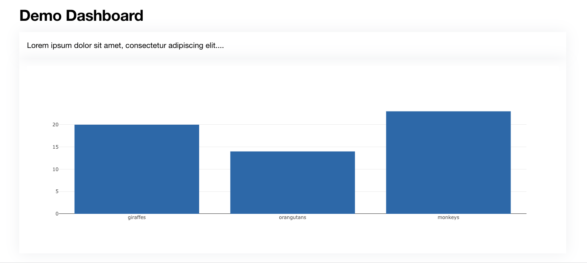

==========
Quickstart
==========

This is a quickstart guide for creating a dashboard.

Project Setup
-------------

Create a new Django project::

    # Create the project directory
    mkdir demo
    cd demo

    # Create a virtual environment
    pyenv virtualenv 3.9.9 django-wildcoeus-demo
    pyenv activate django-wildcoeus-demo

    # Install Django and Wildcoeus into the virtual environment
    pip install django
    pip install django-wildcoeus

    # Set up a new project
    django-admin startproject demo .
    cd demo
    django-admin startapp mydashboard
    cd ..

    # Sync the database
    python manage.py migrate

Dashboards
----------
First you need to setup a dashboard definition.  Create a new file :code:`demo/mydashboard/dashboards.py`::

    from wildcoeus.dashboards.dashboard import Dashboard
    from wildcoeus.dashboards.component import Text, Chart
    from wildcoeus.dashboards.registry import registry
    from demo.mydashboard.data import DashboardData

    class DemoDashboard(Dashboard):
        text_example = Text(value="Lorem ipsum dolor sit amet, consectetur adipiscing elit....")
        chart_example = Chart(defer=DashboardData.fetch_bar_chart_data)

        class Meta:
            name = "Demo Dashboard"

    registry.register(DemoDashboard)

Remember to register your dashboard class in order for it to work with the auto urls.  See Config for additional step.

Data
----
Data for the dashboard component can be inline (text_example) or come from a callable (chart_example).
In the example above the data for chart_example is returned from fetch_bar_chart_data.  We set this up now.
Create a new file :code:`demo/mydashboard/data.py`::

    import json

    class DashboardData:
        @staticmethod
        def fetch_bar_chart_data(**kwargs) -> str:
            data = {"giraffes": 20, "orangutans": 14, "monkeys": 23}

            return json.dumps(dict(
                data=[
                    dict(
                        x=list(data.keys()),
                        y=list(data.values()),
                        type="bar",
                    )
                ]
            )

This returns a json object with values for x, y, and type.  This is interporated by the component and rendered as a bar chart.

Config
------
In order to get the auto urls to register we need to update :code:`demo/mydashboard/apps/py`::

    from django.apps import AppConfig

    class MydashboardConfig(AppConfig):
        default_auto_field = 'django.db.models.BigAutoField'
        name = 'demo.mydashboard'

        def ready(self):
            # for registry
            import demo.mydashboard.dashboards  # type: ignore # noqa

URLs
----
Next we need to wire up the dashboard urls.  In :code:`demo/urls.py`::

    from django.contrib import admin
    from django.urls import include, path

    urlpatterns = [
        path('admin/', admin.site.urls),
        path('dashboards/', include('wildcoeus.dashboards.urls')),
    ]

Settings
--------
Finally add :code:`wildcoeus`, :code:`wildcoeus.dashboards` and your new app :code:`demo.mydashboard` to INSTALLED_APPS in :code:`demo/settings.py`::

    INSTALLED_APPS = [
        ...
        "wildcoeus",
        "wildcoeus.dashboards",
        "demo.mydashboard",
    ]

And we're done.

Viewing the Dashboard
---------------------
Start the Django server from the command line.::

    python manage.py runserver

The dashboard urls are automatically generated based on the app name and dashboard meta name.
For this demo the url will be :code:`http://127.0.0.1:8000/dashboards/mydashboard/demodashboard/`

