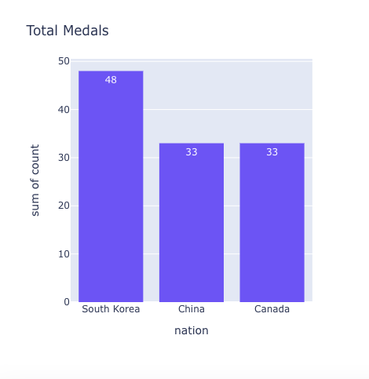

==================
Chart Serializers
==================

A ``ChartSerializer`` object can be passed to any ``Chart`` component as a argument for ``value`` or ``defer``:

::
    class DemoDashboard(Dashboard):
        chart_example_value = Chart(value=ExampleChartSerializer)
        chart_example_defer = Chart(defer=ExampleChartSerializer)
    ...

Serializers automatically fetch and convert data into a format which can be rendered by the Chart component.

Creating a Chart Serializer
++++++++++++++++++++++++++++

To create a Chart Serializer all you need to do is: inherit from ``ChartSerializer``, define your data
and implement a ``to_fig`` method.

Data
****

If your data is stored in a Django model, the defining your
data step becomes really easy.  Either set the Model you're interested in (in the
serializers Meta class), or if you need more control over the queryset you can override the `get_queryset()` method.

When working with querysets and models you should also define ``fields`` in the ``Meta`` class.
This is a list of fields on your model which you are interested in.  Under the hood
the serializer also converts your queryset into a Pandas Dataframe so is
required for this.::

    from dashboards.component.chart import ChartSerializer
    from yourapp.models import ExampleModel

    class ExampleChartSerializer(ChartSerializer):
        class Meta:
            title = "Example Chart"
            fields = ["key", "value"]
            model = ExampleModel
        ...

or::

    from dashboards.component.chart import ChartSerializer
    from yourapp.models import ExampleModel

    class ExampleChartSerializer(ChartSerializer):
        class Meta:
            title = "Example Chart"
            fields = ["key", "value"]

        def get_queryset(self, *args, **kwargs):
            return ExampleModel.objects.filter(value__gt=10)
        ...

Both these examples assume you have a Django model with a ``key`` and ``value`` field::

    class ExampleModel(models.Model):
        key = models.CharField(max_length=25)
        value = models.IntegerField(default=0)
        ...

When overriding ``get_queryset()`` you also have access to any GET or POST data as well as request via the kwargs::

    def get_queryset(self, *args, **kwargs):
        filters = kwargs["filters"]  # any GET / POST data
        request = kwargs["request"]  # django request object

        qs = ExampleModel.objects.all()
        qs = qs.filter(created_by=request.user)
        qs = qs.filter(key=filters.get("key"))

        return qs

If your data doesn't come from a Django model you can still use serializers to prepare your data for Charts.
To do this just override the ``get_data`` method on the serializer for example below we pull a pandas Dataframe
example from plotly express.:F

    def get_data(self, *args, **kwargs):
        df = px.data.medals_long()

        return df

This example returns data from the in-built Pandas function medals_long().

Just like ``get_queryset()``, ``get_data()`` also has access to any GET or POST data as well as the request in kwargs.::

    def get_data(self, *args, **kwargs):
        df = px.data.medals_long()
        filters = kwargs["filters"]  # any GET / POST data
        df= df.query(f"medal" == '{filters["medal"]}'")

        return df

``get_data`` expects that you return a Pandas Dataframe.

to_fig
******

``to_fig()`` defines how to convert your raw data into something which the chart can display.
It accepts 1 argument, a Pandas Dataframe (which is what your queryset gets converted to).

Under the hood the Chart component uses Plotly to display charts so it expects
you to return a plotly ``Figure`` object, hence the name ``to_fig``.

::

    class ExampleChartSerializer(ChartSerializer):
        class Meta:
            title = "Total Medals"

        def get_data(self, *args, **kwargs):
            df = px.data.medals_long()
            return df

        def to_fig(self, df):
            fig = px.bar(
                df,
                x="key",
                y="value",
            )

            return fig

    This example displays a bar chart with ``key`` values along the x-asis and ``value`` values in the y-axis.:

We deliberately left ``to_fig`` unimplemented so you can have final say over
which charts you require.

However we understand that defining `to_fig` on every Serializer can become tedious, especially if they are
all the same, so we recommend creating some Base serializer classes for each chart type you require. e.g.::

    import plotly.express as px
    import plotly.graph_objects as go

    class ScatterChartSerializer(ChartSerializer):
        x: Optional[str] = None
        y: Optional[str] = None
        mode: Optional[str] = "lines+markers"

        def to_fig(self, df) -> go.Figure:
            fig = px.scatter(
                df,
                x=self.x,
                y=self.y,
            )
            fig = fig.update_traces(
                mode=self.mode
            )

            return fig

    class BarChartSerializer(ChartSerializer):
        x: Optional[str] = None
        y: Optional[str] = None
        color: Optional[str] = None
        orientation: Optional[str] = "v"
        barmode: Optional[str] = "stack"

        def to_fig(self, df) -> go.Figure:
            fig = px.bar(
                df,
                x=self.x,
                y=self.y,
                color=self.color,
                orientation=self.orientation,
                barmode=self.barmode,
            )

            return fig

This simple example gives you 2 chart types: Bar and Scatter, which you can then build your serializers from e.g.::

    class ExampleBarChartSerializer(BarChartSerializer):
        x = "key"
        y = "value"

        class Meta:
            title = "Example Bar Chart"
            fields = ["key", "value"]
            model = ExampleModel

    class ExampleScatterChartSerializer(ScatterChartSerializer):
        x = "key"
        y = "value"

        class Meta:
            title = "Example Scatter Chart"
            fields = ["key", "value"]
            model = ExampleModel

Layout
******

When creating a Serializer you can define a ``title``, ``width`` and ``height`` in the Meta class.
If set, the title is shown on the chart and width and height define its size.::

    ...
    class Meta:
        title = "Example Chart"
        width: 500
        height: 500

This gives some control over the chart display but if you want further control you can
set a layout dictionary on your serializer::

    class ExampleChartSerializer(BarChartSerializer):
        x = "nation"
        y = "count"
        layout = dict(
            xaxis_title="Nation",
            yaxis_title="Total Medals",
            font=dict(family="Courier New, monospace", size=14, color="RebeccaPurple"),
        )

        class Meta:
            title = "Total Medals"

        def get_data(self, *args, **kwargs):
            df = px.data.medals_long()

            return df

This allows you to change the total look and feel of any chart.  See the Plotly documentation
for a full list of parameters you can set - https://plotly.com/python/reference/layout/