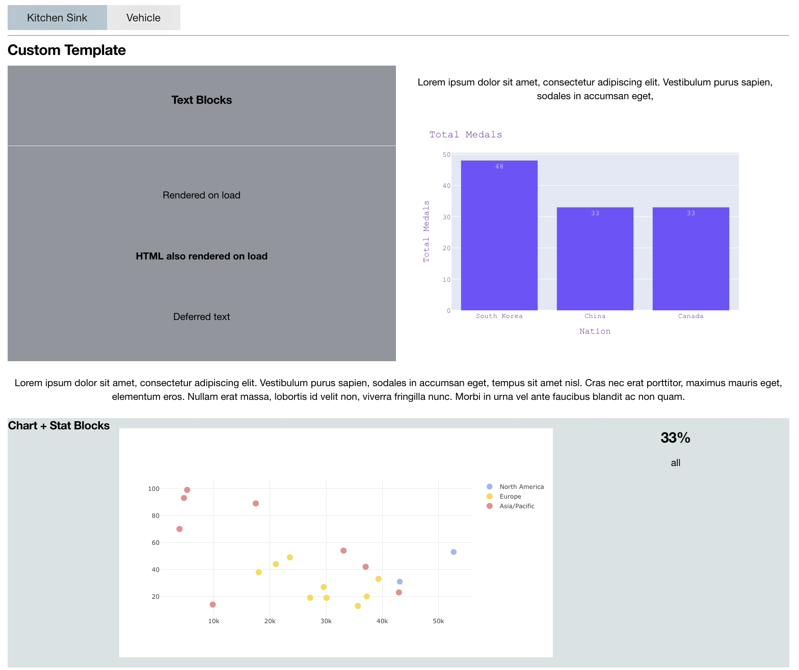

==================
Templates & Styles
==================

django-dashboards comes with a set of default templates and styles but these can be
easily customised to fit your needs.

Design
------

django-dashboards comes with a default css stylesheet which includes a grid layout
as well as basic styling for each component.

.. image:: _images/templates_style.png
   :alt: Default Style

This is enough to get you started but it is expected that you would either build
on this or replace it.

Setting up a Base Template
++++++++++++++++++++++++++

When starting a new project the first thing you probably want to do is add your
own base template which incorporates your branding and any navigation elements
which may be required.

This works exactly the same as in Django so this should be familiar
to you if you are coming from a Django background.

::

    # templates/dashboards/base.html

    <!DOCTYPE html>
    <html lang="en">
        <head>
            <title>django-dashboards | {{ dashboard.get_meta.name }}</title>
            <meta charset="utf-8">
            <meta name="viewport" content="width=device-width, initial-scale=1, shrink-to-fit=no">
            
            
        </head>
        <body hx-headers='{"X-CSRFToken": "{{ csrf_token }}"}'>
            
                
                

                    
                

            
        </body>
    </html>

This is the default HTML code in django-dashboards.  When creating your own base template
you should follow this so you don't loose any content blocks.

::

    ...
    <body hx-headers='{"X-CSRFToken": "{{ csrf_token }}"}'>
        
            

                
            

            
              
            
            
            

                
            

            

                
            

        
    </body>
    ...

Here we have added a logo, menu and footer element.
See :doc:`menus` for a description on how to generate a menu
based on your dashboards.

Dashboard Template
++++++++++++++++++

If you have created a base template which is not in the
folder ``templates/dashboards/base.html`` or you
simply want to change how the default dashboard page looks you
can do this by creating a ``dashboard.html``
file in ``templates/dashboards/``.

::

    # templates/dashboards/dashboard.html

    
    
    

    
        {{ block.super }}
        
    

    
        {{ block.super }}
        
    

    
      <h2>{{ dashboard.get_meta.name }}</h2>
    

    
      

        
      

    

This example is the default django-dashboards file.

The file should extend from ``base.html`` and you should populate / add the
blocks as required.  If you have created your own base template make sure
to update the extends path.

CSS
+++

django-dashboards comes with its own css styles which are imported from the file
``dashboards/includes/static/style.html``  If you want to continue
using these styles make sure
````
is present in the ``dashboards_style`` block.

If you wish to remove the base styles you can either: create your own
``dashboards/includes/static/style.html`` file locally or
set the block to empty if you are overriding dashboard.html or base.html ::

    

django-dashboards includes Datatables for the Table component and requires
``dashboards/vendor/css/datatables.min.css`` for styling.
If you have removed ``dashboards/includes/static/style.html`` remember
to add this import somewhere or your tables will not be styled.

If you want to include your own stylesheet(s) as well as the default one,
you can either:

Create a ``dashboards/includes/static/style.html`` locally
which imports dashboards.css

Or

Include them in your local dashboard.html or base.html file ::

    
        
        <link rel="stylesheet" href="">
    

If adding them to base.html you will need to have ``{{ block.super }}``
in the dashboard.html ``dashboards_style`` block.

JS
+++

Just as with CSS, you can override the default JS files used by:
creating your own ``dashboards/includes/static/js.html``, or changing
the ``dashboards_js`` block in base.html or dashboard.html ::

    
        {{ block.super }}
        
    

This is useful if you want to add extra Javascript files to your project or
have custom components which require additional JS libraries.

Another reason you may override this is if you are wanting to add a build tool
such as Vite JS or Webpack to your project to replace the default setup.

django-dashboards needs certain js libraries to function correctly so check which
libraries are in
``dashboards/includes/static/js.html`` before making changes.

render_dashboard template tag
+++++++++++++++++++++++++++++

The code which actually renders the dashboards is ::

    ...
    
    ...

This uses the template tag ``render_dashboard`` from ``dashboards`` and takes
the dashboard object and renders it to the page.

Using this template tag allows you to render a dashboard to any template you wish.
So, if you had a custom view which required a dashboard object you could
use this in the template to display the dashboard.

Overriding Default Component Templates
--------------------------------------

Each Component, including LayoutComponents, come with their own template file
which can be overriden to fit your needs.

To override the default template simply create a file in your ``templates``
folder which matches the path for the component (see below).

**Components**:

* ``Chart`` - dashboards/components/chart/chart.html
* ``Form`` - dashboards/components/form/form.html
* ``Map`` - dashboards/components/form/map.html
* ``Table`` - dashboards/components/table/index.html
* ``BasicTable`` - dashboards/components/table/basic.html
* ``HTML`` - dashboards/components/table/html.html
* ``Stat`` - dashboards/components/table/stat.html
* ``Text`` - dashboards/components/table/text.html

Replacing these files will update all components on a dashboard.

If overriding a Component file, note that some of the more advanced
components require boilerplate code to function so you should only do this
if absolutely necessary.

Updating a LayoutComponent template is safer and probably more likely.

**LayoutComponents**:

* ``Card`` - dashboards/layout/components/card.html
* ``Div`` - dashboards/layout/components/div.html
* ``Tab`` - dashboards/layout/components/tab.html, dashboards/layout/components/container.html, dashboards/layout/components/content.html

The default templates come with their own structure and css applied but this
may not fit your needs.  For example if you have integrated Bootstrap
you may want to change the Card component to match the HTML of a Bootstrap card.

LayoutComponent CSS Classes
+++++++++++++++++++++++++++

There maybe cases where you just need to alter the css classes on a component
rather than changing the HTML.  An example could be if you are using Bootstrap
css you may want the component to include some additional Bootstrap
helper classes.

django-dashboards allows you to change the default css classes for any Component or
LayoutComponent via the setting ``DASHBOARDS_LAYOUT_COMPONENT_CLASSES``
and ``DASHBOARDS_COMPONENT_CLASSES``.

DASHBOARDS_LAYOUT_COMPONENT_CLASSES
+++++++++++++++++++++++++++++++++++

The value should be a dict containing all or any keys ``Card``, ``Tab``, ``Div``,
with each key being either a dictionary depending on
requirement - see defaults below.

The default classes are ::

    CARD_CLASSES: Dict[str, str] = {
        "card": "card_component__card",
        "header": "card_component__card-header",
        "image": "card_component__card-img",
        "body": "card_component__card-body",
        "footer": "card_component__card-footer",
    }

    TAB_CONTAINER_CLASSES: Dict[str, str] = {
        "tab_container": "tab_component__container",
        "tab_list": "tab_component__tabs",
        "tab_content": "tab_component__content",
    }

    TAB_CLASSES: Dict[str, str] = {
        "li": "tab_component__li",
        "link": "tab_component__link",
    }

    DIV_CLASSES: Dict[str, str] = {
        "wrapper": ""
    }

For example to update the ``header`` class for ``Card`` you would add ::

    DASHBOARDS_LAYOUT_COMPONENT_CLASSES = {
        "Card": {
            "header": "alternative-card-header",
        }
    }

To your settings.py file.

Any keys not defined will default to the original definition.

DASHBOARDS_COMPONENT_CLASSES
++++++++++++++++++++++++++++

The value should be a dict containing all or any keys ``Form``, ``Table``,
``BasicTable``, ``Stat`` and ``Chart`` with each key being either a
string or dictionary depending on
requirement - see defaults below.

The default classes are ::

    FORM_CLASSES: Dict[str, str] = {
        "form": "form",
        "table": "table form-table",
        "button": "btn",
    }

    TABLE_CLASSES: Dict[str, str] = {
        "table": "table"
    }

    STAT_CLASSES: Dict[str, str] = {
        "stat": "stat",
        "icon": "stat__icon",
        "heading": "stat__heading",
        "text": "stat__text",
    }

For example to update the ``stat`` class for ``Stat`` you would add ::

    DASHBOARDS_COMPONENT_CLASSES = {
        "Stat": {
            "stat": "stat",
            "icon": "stat__icon",
            "heading": "stat__heading",
            "text": "stat__text",
        }
    }

To your settings.py file.

Any keys not defined will default to the original definition.

Setting an Alternative Template
-------------------------------

Both ``Dashboard`` and ``Component`` objects allow you to provide
an alternative template when creating them.  This allows you to customise
the layout on an instance by instance basis.

Custom Dashboard Template
+++++++++++++++++++++++++

You can override the default dashboard template by
providing a ``template_name`` to the dashboards Meta class.

::

    # dashboard.py
    ...
    class DemoDashboardCustomTemplate(Dashboard):
        ...
        class Meta:
            name = "Custom Template"
            template_name = "demo/custom.html"
    ...

.. note::
   The full example code for this dashboard is available in the repo at ``demos/dashboard/demo/kitchensink/dashboards.py``

This is useful if you wish to create a complex layout that
is not possible via the ``LayoutComponent`` or grid css classes - see :doc:`layout`.
You may also use this if you wish to add additional HTML elements which are
not present in the Dashboard and don't want to do it via Layout.

::

    # templates/demo/custom.html
    

        <h3>Text Blocks</h3>
        

        {{ dashboard.components.text_example }}
        {{ dashboard.components.html_example }}
        {{ dashboard.components.calculated_example }}
    

    

      

        Lorem ipsum dolor sit amet, consectetur adipiscing elit. Vestibulum purus sapien, sodales in accumsan eget,
      

        {{ dashboard.components.chart_example }}
    

    

      Lorem ipsum dolor sit amet, consectetur adipiscing elit. Vestibulum purus sapien, sodales in accumsan eget,
      tempus sit amet nisl. Cras nec erat porttitor, maximus mauris eget, elementum eros.
      Nullam erat massa, lobortis id velit non, viverra fringilla nunc.
      Morbi in urna vel ante faucibus blandit ac non quam.
    

    

      <h3>Chart + Stat Blocks</h3>
        

            {{ dashboard.components.line_chart_example }}
        

        

            {{ dashboard.components.stat_three }}
        

    

.. note::
    you access individual components from the ``components`` attribute
    on the ``dashboard`` object.  Keys should match the attribute name in
    the Dashboard class.

Custom Component Templates
++++++++++++++++++++++++++

Like dashboards, each component has its own default template
which can be overriden.

::

    # dashboard.py
    ...
    class DemoDashboard(Dashboard):
        pill = Text(value="Lorem ipsum dolor sit amet", template_name="demo/pill.html")
    ...

    # templates/demo/pill.html
    

      
      {{ rendered_value|safe }}
      
      {{ rendered_value }}
      
    

.. image:: _images/templates_custom_component_template.png
   :alt: Custom Component Template

As some of the more advanced components require boilerplate code to function
you should only do this if absolutely necessary.

If you do, make sure to review the original template first.

Alternative loading message
---------------------------

By default django-dashboards shows the text "Loading..." while a deferred component
is loading.  You can change this by creating your own a loading.html
template in the folder ``templates/dashboards/components/``

::

    # templates/dashboards/components/loading.html
    

        
    

.. image:: _images/templates_custom_loading.png
   :alt: Custom Loading Image

Changing the Default Grid Layout
--------------------------------

Dashboards follow a grid layout with a default of 2 components per row.
You can change this by adding ``DASHBOARDS_DEFAULT_GRID_CSS`` to your settings
file.

::

    DASHBOARDS_DEFAULT_GRID_CSS = "span-6"

The value should match a css class available in the stylesheet(s). The following
classes are available in dashboards.css:

* ``span-3`` - 4 columns
* ``span-4`` - 3 columns
* ``span-6`` - 2 columns
* ``span-8`` - 1 column 2/3 full
* ``span-9`` - 1 column 3/4 full
* ``span-12`` 1 column

This can also be done at component level - see :doc:`layout`.